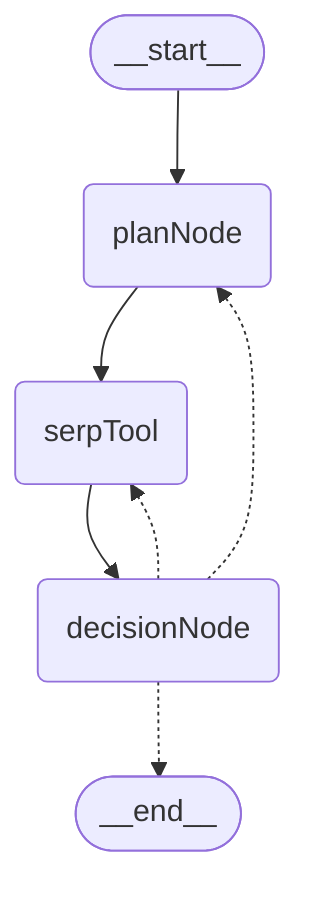

# agentSerpWorker
A Plan-and-excute(search) agent build with Langgraph and FastHTML.

- <strong>No function-call feature required.</strong>
- Use any LLM api that follows the OpenAI format.
- Raad missions from notion by Status "Mission" and write the result back to notion




## Usage

1. Copy .env_example to .env and fill out the necessary information.
2. Run ```poetry install```
3. Run ```poetry run python app.py```
